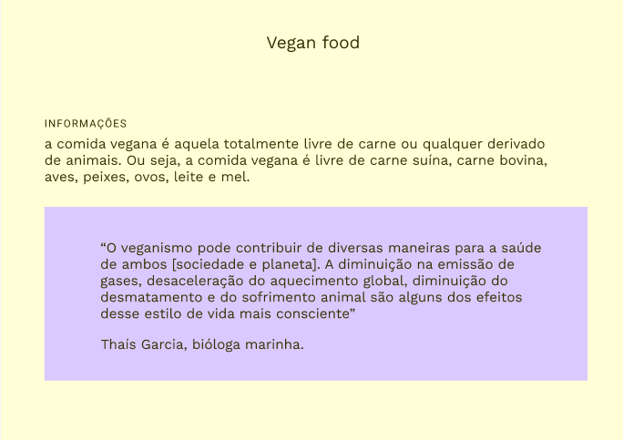

<h1 align="center">veganFood.</h1>

🚀 Site educacional.

OBS: neste projeto aprendi como selecionar tags de outras formas, a centralizar o conteúdo e estilos especificos como o das aspas verdadeira.
<h4>Status do projeto: Concluido...</h4>

<h1>Link para acessar: </h1>

<h1>🛠 Tecnologias:</h1>

HTML

CSS

Figma

<h1>Autor: </h1>

Gabriel Eustaquio

